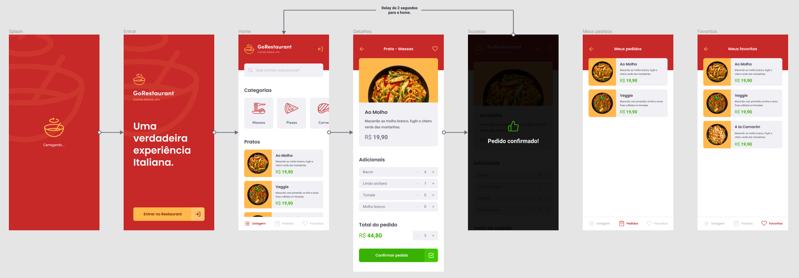

[](http://hits.dwyl.com/robertorodrigues/robertoarodrigues/gorestaurantmobile)

# GoRestaurant
Estudo de navegação e filtros no React Native.

<p align="center">
  
</p>

<p align="center">
  
</p>

# Construído com:
* React Native
* Typescript
* Jest

# Testes
Para inicializar todos os testes já preparados, utilize <code> yarn test </code>.

# Para Obter esse repositório:
Siga os passos:
1. Clone esse repositório utilizando <code>git clone</code>.
2. Rode o comando <code> yarn </code> na raíz da pasta do projeto clonado para baixar as dependências.
3. Rode <code>json-server server.json -p 3333</code> na raíz da pasta do projeto para inicializar a Fake API.

# Para contribuir:
Siga os passos:

```bash
# Clone o seu fork
$ git clone url-do-seu-fork && cd GoRestaurantWeb

# Crie uma branch com sua feature ou correção de bugs
$ git checkout -b minha-branch

# Faça o commit das suas alterações
$ git commit -m 'minhas alterações'

# Faça o push para a sua branch
$ git push origin minha-branch
```

# Autor:

* **Roberto Rodrigues** [Linkedin](https://www.linkedin.com/in/robertorodriguesazevedo/)
